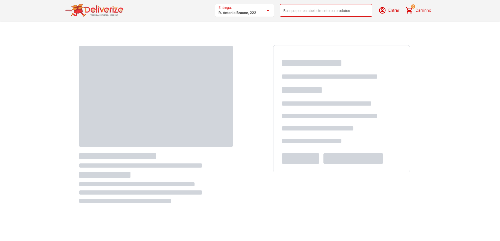

<h1 align="center"> Deliverize - TeamSoft </h1>

## 💻 Projeto

O projeto consiste em um layout que simula uma página de pedidos de um restaurante. O desafio foi clonar o layout fornecido pela empresa TeamSoft ficando o mais próximo possível do original. Meu objetivo foi utilizar TypeScript, NextJS e TailwindCSS para desenvolver o projeto. Aplicação do conceito de responsividade e utilização de componentes reutilizáveis e clean code.

  <a href="#-tecnologias">Tecnologias</a>&nbsp;&nbsp;&nbsp;|&nbsp;&nbsp;&nbsp;
  <a href="#-projeto">Projeto</a>&nbsp;&nbsp;&nbsp;&nbsp;&nbsp;&nbsp;</a>

 

  

## 🚀 Tecnologias

Esse projeto foi desenvolvido com as seguintes tecnologias:

- [React](https://reactjs.org)
- [TypeScript](https://www.typescriptlang.org/)
- [NextJS](https://nextjs.org/)
- [TailwindCSS](https://tailwindcss.com/)
- [react-icons](https://react-icons.github.io/react-icons/)

---

Feito com ♥ by Gustavo Batista :wave: [LinkedIn](https://www.linkedin.com/in/gustavo-h-batista/) e [GitHub](https://github.com/gustavohdab)
